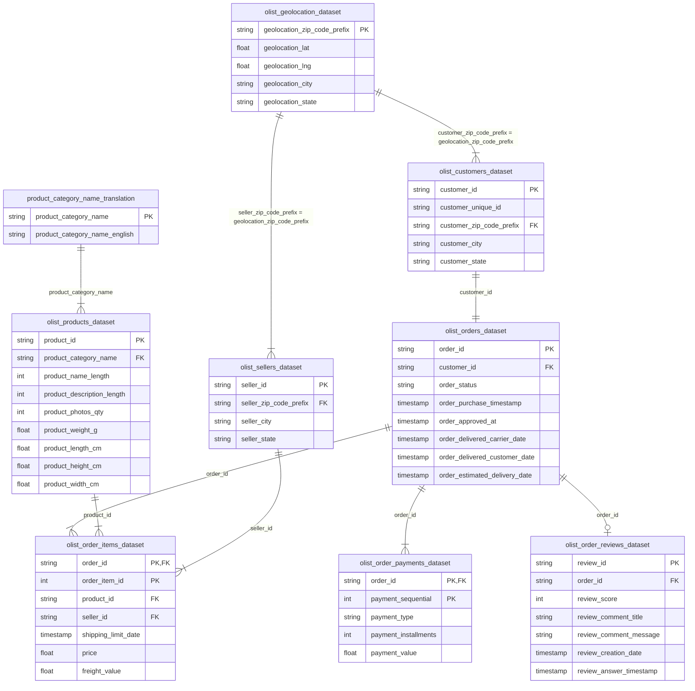

# Analisis Kinerja E-Commerce & Perilaku Pelanggan Olist Brasil

Dashboard Interaktif: [https://izamrosiawan.github.io/olist-brazilian-ecommerce-analytics/](https://izamrosiawan.github.io/olist-brazilian-ecommerce-analytics/)  
Akses Lokal: Buka [index.html](index.html) langsung di browser.

---

## Latar Belakang & Masalah Bisnis
Proyek ini menganalisis data transaksi platform marketplace **Olist** di Brasil untuk mengidentifikasi kategori produk pendorong utama pendapatan, menganalisis performa logistik dan SLA pengiriman antar wilayah, serta mengukur tingkat retensi pelanggan guna memberikan rekomendasi berbasis data.

---

## Ringkasan Eksekutif

- **Tujuan**: Menganalisis **100.000+ transaksi** (2016–2018) dari Olist untuk mengoptimalkan operasional logistik, strategi pemasaran produk, dan retensi pelanggan.
- **Temuan Utama**:
  - **Pendorong Pendapatan**: Penjualan didominasi oleh kategori *Health & Beauty* (volume tinggi) dan *Watches & Gifts* (AOV tinggi) dengan kontribusi masing-masing >**1,2 juta BRL**.
  - **Konsentrasi Regional**: Wilayah São Paulo menjadi pusat transaksi terbesar (15.540 pesanan, total nilai >**2,2 juta BRL**).
  - **SLA Pengiriman**: Rata-rata pengiriman nasional adalah **12,3 hari**. Wilayah Utara seperti Amazonas (AM) mencatatkan waktu kirim rata-rata terlama (**25,6 hari**).
  - **Dampak Logistik pada Sentimen**: Terdapat korelasi negatif (**-0,31**) antara durasi pengiriman dan skor ulasan. Pesanan bintang 5 rata-rata tiba dalam **10,6 hari**, sedangkan ulasan bintang 1 mencapai **20,2 hari**.
  - **Tingkat Retensi**: Pembelian berulang (*repeat purchase rate*) tergolong rendah di angka **3,12%** (>96,8% pelanggan hanya bertransaksi satu kali).
- **Rekomendasi Bisnis**:
  - Optimasi jaringan logistik di wilayah Utara (AM, AP) untuk menekan waktu kirim di bawah 15 hari.
  - Alokasi prioritas persediaan dan anggaran iklan pada kategori *Health & Beauty* serta *Watches & Gifts*.
  - Penerapan program retensi dan kampanye re-engagement untuk menaikkan rasio repeat purchase.

---

## Kualitas Data & Metodologi

- **Imputasi Data**: Nilai spesifikasi produk yang kosong diisi menggunakan nilai median berdasarkan kategori produk. Review teks yang kosong diabaikan karena tidak memengaruhi skor rating numerik.
- **Pembersihan Outlier**: Pesanan dengan durasi pengiriman negatif (akibat kesalahan data entri kurir) dan pengiriman ekstrem >60 hari dikeluarkan dari dataset analisis.
- **Asumsi**: Stempel waktu transaksi dan pengiriman (`delivered_to_customer_date`) diasumsikan akurat merepresentasikan waktu penerimaan barang oleh pelanggan.

---

## Wawasan Utama & Visualisasi

### 1. Kategori Produk Pendorong Pendapatan
Kategori **Health & Beauty** dan **Watches & Gifts** menyumbangkan pendapatan terbesar masing-masing melebihi **1,2 juta BRL**.

### 2. Konsentrasi Penjualan Regional
Kawasan **São Paulo** mendominasi pasar dengan kontribusi **15.540 pesanan** dan total pendapatan >**2,2 juta BRL**.

### 3. Tren Penjualan & Musiman
Terjadi peningkatan penjualan dari 2017 hingga pertengahan 2018. Lonjakan tertinggi tercatat pada **November 2017** mencapai **1,19 juta BRL** (+53% MoM) didorong oleh periode **Black Friday**.

### 4. Distribusi Waktu Pengiriman Regional
Rata-rata nasional waktu pengiriman adalah **12,3 hari** (median: 10,2 hari):
- **Tercepat**: São Paulo (rata-rata **8,7 hari**).
- **Terlama**: Amazonas / AM (**25,6 hari**) dan Amapá / AP (**24,8 hari**).

### 5. Metode Pembayaran
**Kartu Kredit** merupakan metode pembayaran utama (**73,9%**), disusul oleh **Boleto** (**19,0%**).

### 6. Kecepatan Pengiriman vs Skor Ulasan
Terdapat korelasi negatif (**-0,31**) antara durasi pengiriman dan ulasan pelanggan:
- **Rating 5**: Rata-rata pengiriman **10,6 hari**.
- **Rating 1**: Rata-rata pengiriman **20,2 hari**.

---

## Pemodelan Database & Analisis SQL

Selain eksplorasi Python, proyek ini menggunakan SQLite untuk pemrosesan kueri relasional terstruktur:

- **[`scratch/build_database.py`](scratch/build_database.py)**: Mengimpor file CSV ke basis data SQLite (`data/olist_portfolio.db`) dan membuat indeks pada kolom KUNCI.
- **[`sql/mom_revenue_growth.sql`](sql/mom_revenue_growth.sql)**: Menghitung pertumbuhan pendapatan bulanan (MoM) menggunakan *Window Function* (`LAG`).
- **[`sql/customer_cohort_analysis.sql`](sql/customer_cohort_analysis.sql)**: Analisis kohort retensi bulanan berdasarkan bulan transaksi pertama.
- **[`sql/top_categories_review_score.sql`](sql/top_categories_review_score.sql)**: Evaluasi hubungan antara performa kategori dan persentase ulasan negatif.
- **[`scratch/run_queries.py`](scratch/run_queries.py)**: Skrip otomatisasi untuk mengeksekusi seluruh kueri SQL.

---

## Keterbatasan & Rencana Pengembangan

- **Keterbatasan**: Dataset tidak memuat informasi Customer Acquisition Cost (CAC) maupun pengeluaran iklan per kanal.
- **Rencana Pengembangan**:
  1. Integrasi data corong pembelian (*clickstream / purchase funnel*).
  2. Pemodelan Machine Learning untuk prediksi potensi churn pelanggan akibat keterlambatan pengiriman.

---

## Reproduksibilitas

1. **Lingkungan**: Python 3.11.x (dependensi tercantum di [`requirements.txt`](requirements.txt)).
2. **Langkah Eksekusi**:
   - Letakkan file dataset CSV di direktori `data/`.
   - Jalankan notebook [`notebook.ipynb`](notebook.ipynb) secara berurutan.
3. **Random Seed**: Penggunaan `random_state = 42` diterapkan pada proses pemodelan dan pembagian dataset.

---

## Skema Dataset (ERD)

Dataset ini terdiri dari 9 tabel relasional:

