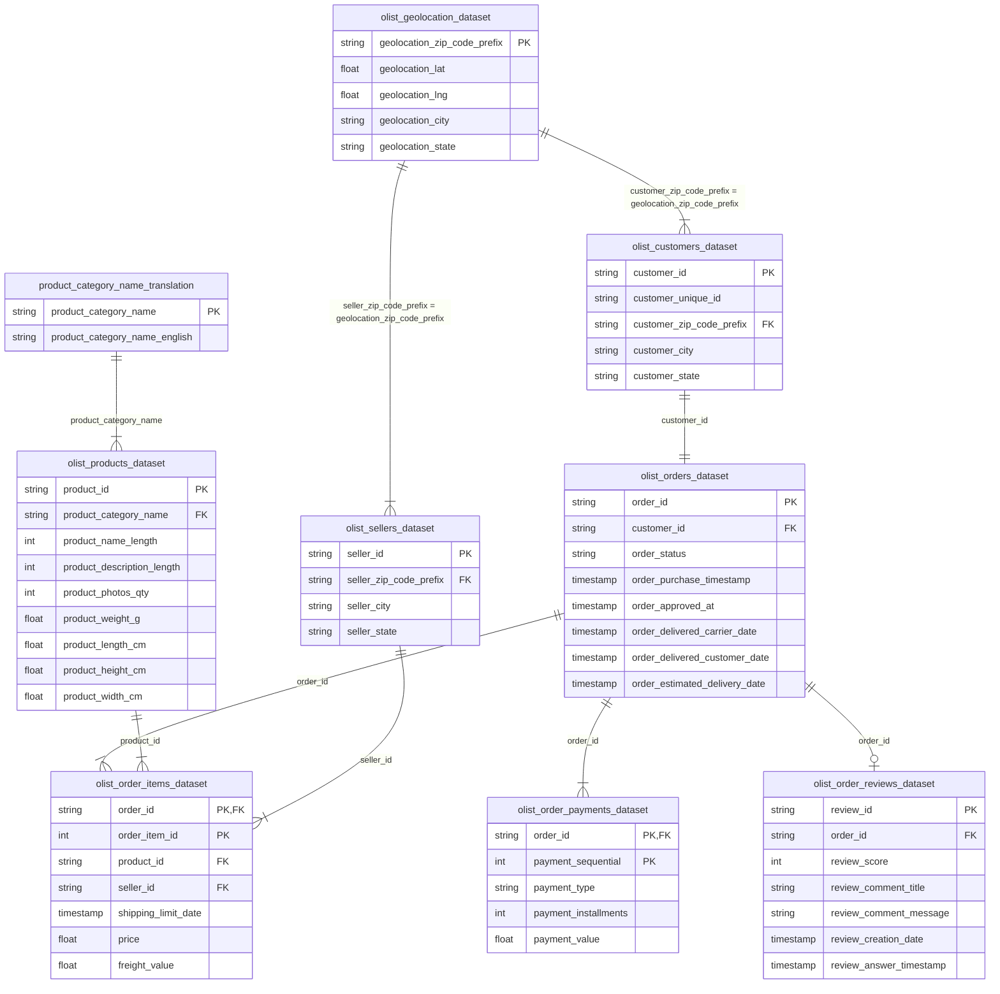

# E-Commerce Olist Brasil: Analisis Bisnis & Laporan Kinerja

Proyek analisis data end-to-end menggunakan Python untuk menganalisis **Dataset E-Commerce Olist Brasil**. Proyek ini memberikan wawasan bisnis yang krusial untuk mengoptimalkan pemasaran penjualan, operasi logistik, dan retensi pelanggan.

---

## 📊 Ringkasan Proyek
Proyek ini berfungsi sebagai laporan diagnostik komprehensif yang menganalisis catatan transaksi, log operasional, dan ulasan pelanggan dari **Olist**, platform integrasi e-commerce terkemuka di Brasil. Dengan menggabungkan dan mempra-proses **lebih dari 100.000 pesanan** dari akhir 2016 hingga pertengahan 2018, laporan ini mendiagnosis masalah di berbagai area bisnis utama:
1. **Pendorong Pendapatan:** Produk apa saja yang mendorong penjualan?
2. **Kinerja Regional:** Di mana permintaan terkonsentrasi?
3. **Tren Temporal:** Kapan penjualan mencapai puncak?
4. **Logistik & Pengiriman:** Seberapa efisien rantai pasok (supply chain)?
5. **Loyalitas Pelanggan:** Apakah pelanggan melakukan pembelian berulang?
6. **Pengalaman Pelanggan:** Bagaimana kecepatan pengiriman memengaruhi skor ulasan?

---

## 🗄️ Skema Dataset (ERD)
Dataset ini terdiri dari 9 tabel yang saling terhubung, awalnya di-host di Kaggle:
* **`olist_customers_dataset.csv`**: Menghubungkan pesanan dengan profil pelanggan yang unik.
* **`olist_orders_dataset.csv`**: Tabel utama yang berisi status pesanan dan log kronologis.
* **`olist_order_items_dataset.csv`**: Detail transaksi tingkat item yang berisi ID produk, ID penjual, harga, dan biaya pengiriman (freight).
* **`olist_order_payments_dataset.csv`**: Pelacakan keuangan pesanan (kartu kredit, boleto, voucher, kartu debit).
* **`olist_order_reviews_dataset.csv`**: Peringkat umpan balik (rating) dan komentar dari pelanggan.
* **`olist_products_dataset.csv`**: Detail produk (berat, dimensi, nama kategori).
* **`olist_sellers_dataset.csv`**: Lokasi dan identitas vendor/penjual di marketplace.
* **`product_category_name_translation.csv`**: Menerjemahkan nama kategori dari bahasa Portugis ke bahasa Inggris.
* **`olist_geolocation_dataset.csv`**: Memetakan kode pos Brasil ke koordinat geografis (lat/lng).

### **Diagram Hubungan (ERD)**



---

## 📈 Visualisasi Utama & Wawasan

### **1. Kategori Pendorong Pendapatan Teratas**
Sebagian besar nilai penjualan dihasilkan oleh sekelompok kecil kategori produk berkinerja tinggi. **Health & Beauty** (Kesehatan & Kecantikan) dan **Watches & Gifts** (Jam Tangan & Kado) adalah kategori utama, masing-masing menghasilkan lebih dari 1,2 juta BRL.
* **AOV vs. Volume:** "Health & Beauty" didorong oleh volume penjualan, sedangkan "Watches & Gifts" didorong oleh nilai rata-rata pesanan (Average Order Value) yang lebih tinggi.


---

### **2. Titik Panas (Hotspot) Kinerja Regional**
Permintaan sangat terkonsentrasi di wilayah Tenggara Brasil. **São Paulo** adalah pendorong utama, menyumbang 15.540 pesanan dan menghasilkan lebih dari 2,2 juta BRL. **Rio de Janeiro** menyusul di tempat kedua, diikuti oleh Belo Horizonte di tempat ketiga.


---

### **3. Musiman & Pertumbuhan Penjualan**
Penjualan tumbuh secara konsisten dari awal tahun 2017 hingga pertengahan 2018. Lonjakan signifikan terjadi pada **November 2017**, mencapai **1,19 juta BRL**—peningkatan bulanan sebesar 53% yang didorong oleh promosi **Black Friday**.


---

### **4. Rantai Pasok & Waktu Pengiriman**
Rata-rata waktu pengiriman di seluruh Brasil adalah **12,3 hari** (median: 10,2 hari). Namun, waktu pengiriman bervariasi secara signifikan berdasarkan wilayah:
* **Tercepat:** Negara bagian di wilayah Tenggara seperti São Paulo rata-rata **8,7 hari**.
* **Terlambat:** Negara bagian terpencil di wilayah Utara seperti Amazonas (AM) rata-rata **25,6 hari** dan Amapá (AP) rata-rata **24,8 hari**.


---

### **5. Loyalitas & Retensi Pelanggan**
Platform ini menghadapi tantangan retensi yang signifikan, dengan tingkat pembelian berulang hanya sebesar **3,12%**. Lebih dari 96,8% pelanggan adalah pembeli satu kali.


---

### **6. Dampak Kecepatan Pengiriman pada Ulasan Pelanggan**
Analisis menunjukkan korelasi negatif yang jelas antara waktu pengiriman dan skor ulasan pelanggan:
* **Ulasan Bintang 5:** Dikirim dalam rata-rata **10,6 hari**.
* **Ulasan Bintang 1:** Dikirim dalam rata-rata **20,2 hari**.
* Keterlambatan pengiriman adalah penyebab utama rendahnya rating pelanggan.


---

## ⚙️ Teknologi yang Digunakan
* **Python 3.11**
* **Pandas & NumPy** untuk pembersihan data, penggabungan, dan agregasi.
* **Matplotlib & Seaborn** untuk visualisasi resolusi tinggi.
* **Jupyter Notebook** untuk analisis interaktif.
* **nbformat** untuk kompilasi notebook secara terprogram.

---

## 🚀 Cara Menjalankan Proyek

### **1. Kloning & Atur Direktori**
Pastikan struktur proyek diatur sebagai berikut:
```text
olist-brazilian-ecommerce-analytics/
├── data/
│   ├── olist_customers_dataset.csv
│   ├── olist_orders_dataset.csv
│   ├── olist_order_items_dataset.csv
│   ├── olist_order_payments_dataset.csv
│   ├── olist_order_reviews_dataset.csv
│   ├── olist_products_dataset.csv
│   ├── olist_sellers_dataset.csv
│   ├── olist_geolocation_dataset.csv (placeholder atau file lengkap)
│   └── product_category_name_translation.csv
├── images/ (grafik hasil ekspor)
├── notebook.ipynb
└── requirements.txt
```

### **2. Instal Dependensi**
Instal paket yang diperlukan menggunakan pip:
```bash
pip install -r requirements.txt
```

### **3. Buka Jupyter Notebook**
Jalankan Jupyter Notebook untuk melihat analisis lengkap yang telah dieksekusi:
```bash
jupyter notebook notebook.ipynb
```
