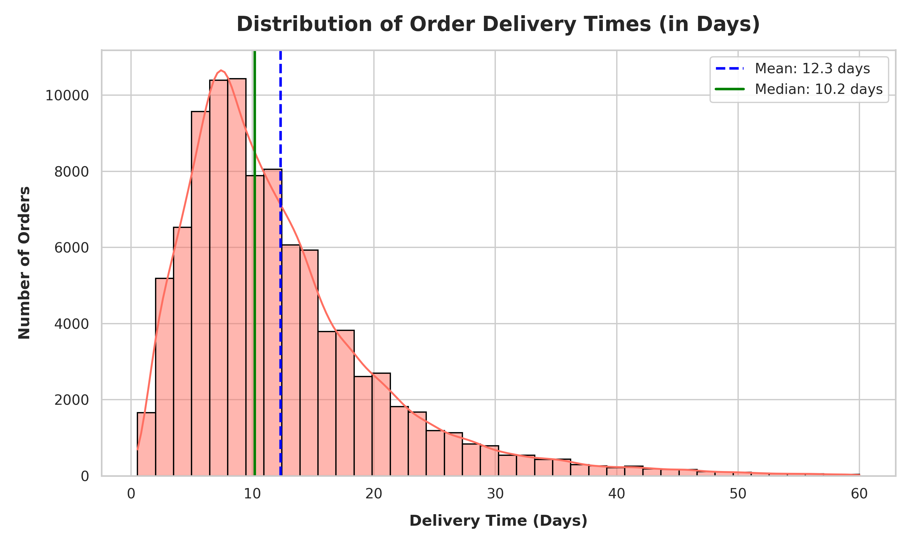
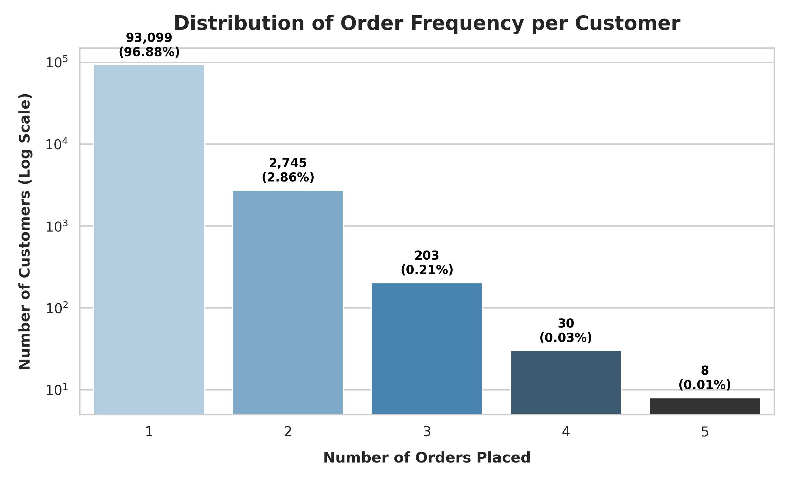

# Olist Brazilian E-Commerce: Business Analytics & Performance Report

An end-to-end data analytics project using Python to analyze the **Olist Brazilian E-Commerce Dataset**. This project provides critical business insights to optimize sales marketing, logisitical operations, and customer retention.

---

## 📊 Project Overview
This project serves as a comprehensive diagnostic report analyzing transaction records, operational logs, and customer reviews from **Olist**, the leading e-commerce integration platform in Brazil. By merging and preprocessing **over 100,000 orders** spanning late 2016 to mid-2018, this report diagnoses issues across key business areas:
1. **Revenue Drivers:** Which products drive sales?
2. **Regional Performance:** Where is demand concentrated?
3. **Temporal Trends:** When do sales peak?
4. **Logistics & Delivery:** How efficient is the supply chain?
5. **Customer Loyalty:** Do customers return?
6. **Customer Experience:** How does delivery speed affect review scores?

---

## 🗄️ Dataset Schema (ERD)
The dataset comprises 9 interconnected tables hosted originally on Kaggle:
* **`olist_customers_dataset.csv`**: Connects orders to unique customer profiles.
* **`olist_orders_dataset.csv`**: The central table containing order status and chronological logs.
* **`olist_order_items_dataset.csv`**: Item-level transaction lines containing product IDs, seller IDs, price, and freight.
* **`olist_order_payments_dataset.csv`**: Finanical tracking of orders (credit card, boleto, voucher, debit card).
* **`olist_order_reviews_dataset.csv`**: Feedback ratings and comments from customers.
* **`olist_products_dataset.csv`**: Details of products (weight, dimensions, category names).
* **`olist_sellers_dataset.csv`**: Locations and identifiers of marketplace vendors.
* **`product_category_name_translation.csv`**: Translates Portuguese categories into English.
* **`olist_geolocation_dataset.csv`**: Maps Brazilian zip codes to coordinates (lat/lng).

### **Relationship Diagram**
```
              [customers] (customer_id)
                   │
                   ▼ (1:1)
  [order_reviews]  ◄─── [orders] ───► [order_payments]
    (order_id)     (1:N)   │   (1:N)   (order_id)
                           ▼ (1:N)
                     [order_items] (order_id)
                       │       │
                 (1:1) ▼       ▼ (1:1)
                  [products]  [sellers] (seller_id)
                       │
                 (1:1) ▼
        [category_translation] (product_category_name)
```

---

## 📈 Key Visualizations & Insights

### **1. Top Revenue-Generating Categories**
The majority of sales value is generated by a small group of high-performance product domains. **Health & Beauty** and **Watches & Gifts** are the leading categories, each bringing in more than 1.2M BRL.
* **AOV vs. Volume:** "Health & Beauty" is volume-driven, whereas "Watches & Gifts" is driven by higher average unit prices.


---

### **2. Regional Performance Hotspots**
Demand is highly concentrated in the Southeast region of Brazil. **São Paulo** is the primary driver, accounting for 15,540 orders and generating over 2.2M BRL. **Rio de Janeiro** follows in second place, with Belo Horizonte in third.


---

### **3. Sales Seasonality & Growth**
Sales grew consistently from early 2017 to mid-2018. A notable spike occurs in **November 2017**, reaching **1.19M BRL**—a 53% monthly increase driven by **Black Friday** promotions.


---

### **4. Supply Chain & Delivery Times**
The average delivery time across Brazil is **12.3 days** (median: 10.2 days). However, delivery times vary significantly by region:
* **Fastest:** Southeast states like São Paulo average **8.7 days**.
* **Slowest:** Remote Northern states like Amazonas (AM) average **25.6 days** and Amapá (AP) averages **24.8 days**.




---

### **5. Customer Loyalty & Retention**
The platform faces a significant retention challenge, with a repeat purchase rate of only **3.12%**. Over 96.8% of users are one-time buyers.



---

### **6. Impact of Delivery Speed on Customer Reviews**
Analysis shows a clear negative correlation between delivery times and customer review scores:
* **5-Star Reviews:** Delivered in **10.6 days** on average.
* **1-Star Reviews:** Delivered in **20.2 days** on average.
* Shipping delays are a primary cause of low customer ratings.


---

## ⚙️ Technologies Used
* **Python 3.11**
* **Pandas & NumPy** for data cleaning, merging, and aggregations.
* **Matplotlib & Seaborn** for high-resolution visualizations.
* **Jupyter Notebook** for interactive analysis.
* **nbformat** for programmatic notebook compilation.

---

## 🚀 How to Run the Project

### **1. Clone & Set Up Directory**
Ensure the project structure is arranged as follows:
```text
olist-brazilian-ecommerce-analytics/
├── data/
│   ├── olist_customers_dataset.csv
│   ├── olist_orders_dataset.csv
│   ├── olist_order_items_dataset.csv
│   ├── olist_order_payments_dataset.csv
│   ├── olist_order_reviews_dataset.csv
│   ├── olist_products_dataset.csv
│   ├── olist_sellers_dataset.csv
│   ├── olist_geolocation_dataset.csv (placeholder or full file)
│   └── product_category_name_translation.csv
├── images/ (exported charts)
├── notebook.ipynb
└── requirements.txt
```

### **2. Install Dependencies**
Install the required packages using pip:
```bash
pip install -r requirements.txt
```

### **3. Open the Notebook**
Launch the Jupyter interface to view the fully executed analysis:
```bash
jupyter notebook notebook.ipynb
```
