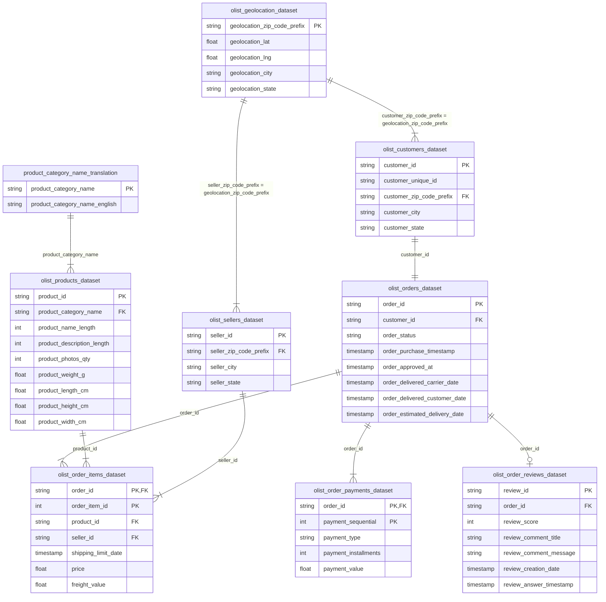

# Analisis Kinerja E-Commerce & Perilaku Pelanggan Olist Brasil

---

### 🌐 Live Dashboard Interaktif
Rasakan antarmuka operasional premium bergaya Swiss Bento Grid yang dirancang khusus untuk proyek ini. Dilengkapi dengan grafik interaktif, analisis SLA geografis, dan deck Simulator Dampak Bisnis.
- 🔗 **Link GitHub Pages**: [https://izamrosiawan.github.io/olist-brazilian-ecommerce-analytics/](https://izamrosiawan.github.io/olist-brazilian-ecommerce-analytics/)
- 💻 **Akses Offline Lokal**: Cukup klik ganda [index.html](index.html) untuk menjalankannya secara lokal (zero CORS, bekerja offline).

---

### 🎯 Pernyataan Masalah Bisnis
Dalam industri e-commerce yang kompetitif, platform marketplace harus mengoptimalkan operasional logistik, mengidentifikasi pendorong pendapatan berkinerja tinggi, dan meningkatkan retensi pelanggan. Proyek ini menganalisis data transaksi untuk mengatasi hambatan logistik dan merancang program retensi yang meningkatkan Customer Lifetime Value (LTV).

---

### 📌 Ringkasan Eksekutif (30 Detik Baca)
* **Tujuan**: Menganalisis **lebih dari 100.000 catatan transaksi** (akhir 2016 hingga pertengahan 2018) dari **Olist**, platform integrasi e-commerce terbesar di Brasil, untuk menemukan pendorong pendapatan, mengoptimalkan logistik, dan meningkatkan kepuasan pelanggan.
* **Temuan Utama**:
  - **Pendorong Pendapatan**: Penjualan didominasi oleh kategori berkinerja tinggi, yaitu *Health & Beauty* (volume tinggi) dan *Watches & Gifts* (AOV tinggi) dengan kontribusi masing-masing di atas **1,2 juta BRL**.
  - **Konsentrasi Regional**: Wilayah São Paulo merupakan pusat pasar terbesar dengan kontribusi **15.540 pesanan** dan total pendapatan lebih dari **2,2 juta BRL**.
  - **Masalah Logistik**: Rata-rata pengiriman nasional adalah **12,3 hari**, namun negara bagian terpencil di Utara seperti Amazonas (AM) memakan waktu rata-rata **25,6 hari**.
  - **Kepuasan & Kecepatan**: Keterlambatan pengiriman adalah faktor utama ulasan buruk. Pesanan dengan rating bintang 5 rata-rata sampai dalam **10,6 hari**, sedangkan rating bintang 1 memakan waktu **20,2 hari** (korelasi negatif **-0,31**).
  - **Rendahnya Retensi**: Tingkat pembelian berulang (*repeat purchase rate*) sangat rendah, hanya sebesar **3,12%** (lebih dari 96,8% pelanggan adalah pembeli satu kali).
* **Rekomendasi Bisnis**:
  - **Optimasi SLA Logistik**: Bangun kemitraan dengan kurir lokal atau posisikan gudang regional di wilayah Utara (AM, AP) untuk memangkas waktu kirim dari 25+ hari menjadi di bawah 15 hari.
  - **Prioritas Iklan & Stok**: Alokasikan budget iklan (berbasis ROAS) dan inventaris produk pada kategori bernilai tinggi (*Watches & Gifts* dan *Health & Beauty*).
  - **Program Retensi Pelanggan**: Terapkan kampanye email otomatis, kupon belanja kedua, dan program loyalitas untuk menaikkan tingkat pembelian berulang dari 3,12% menjadi target 8%.

---

### 🛡️ Kualitas Data & Asumsi
* **Missing Values**: Data spesifikasi produk yang kosong (seperti dimensi dan panjang deskripsi) diimputasi menggunakan nilai median berdasarkan kategori produk masing-masing. Review teks pelanggan yang kosong dibiarkan karena tidak berdampak pada penilaian rating numerik.
* **Outlier Treatment**: Rekaman pengiriman yang memiliki durasi pengiriman negatif (akibat kesalahan input kurir) dan pesanan dengan waktu kirim di atas 60 hari dihapus agar tidak mendistorsi analisis rata-rata.
* **Asumsi**: Kami mengasumsikan log stempel waktu kurir akurat, dan data `delivered_to_customer_date` merepresentasikan waktu aktual saat pelanggan menerima paket.

---

### 📊 Wawasan Utama & Visualisasi

#### 1. Kategori Produk Pendorong Pendapatan
Sebagian besar nilai penjualan dihasilkan oleh sekelompok kecil kategori produk. **Health & Beauty** dan **Watches & Gifts** adalah kategori utama, masing-masing menghasilkan lebih dari **1,2 juta BRL**.

#### 2. Titik Panas Kinerja Regional
Permintaan sangat terkonsentrasi di wilayah Tenggara Brasil. **São Paulo** menyumbang **15.540 pesanan** dan menghasilkan lebih dari **2,2 juta BRL**.

#### 3. Musiman & Pertumbuhan Penjualan
Penjualan tumbuh secara konsisten dari awal tahun 2017 hingga pertengahan 2018. Lonjakan signifikan terjadi pada **November 2017**, mencapai **1,19 juta BRL** (naik **53%** bulanan) karena promosi **Black Friday**.

#### 4. Waktu Pengiriman Regional
Rata-rata waktu pengiriman di seluruh Brasil adalah **12,3 hari** (median: 10,2 hari):
* **Tercepat**: São Paulo rata-rata **8,7 hari**.
* **Terlambat**: Amazonas (AM) rata-rata **25,6 hari** dan Amapá (AP) rata-rata **24,8 hari**.

#### 5. Metode Pembayaran
**Kartu Kredit** mendominasi pembayaran sebesar **73,9%**, diikuti oleh **Boleto** sebesar **19,0%**.

#### 6. Dampak Kecepatan Pengiriman pada Ulasan Pelanggan
Analisis menunjukkan korelasi negatif yang jelas (**-0,31**) antara waktu pengiriman dan skor ulasan pelanggan:
* **Ulasan Bintang 5**: Dikirim dalam rata-rata **10,6 hari**.
* **Ulasan Bintang 1**: Dikirim dalam rata-rata **20,2 hari**.

---

### ⚠️ Keterbatasan & Langkah Selanjutnya
* **Keterbatasan**: Dataset tidak memiliki metrik biaya akuisisi (CAC) dan biaya iklan per kanal, sehingga ROI pemasaran secara detail tidak dapat dihitung.
* **Langkah Selanjutnya**:
  1. Integrasikan data clickstream untuk menganalisis corong pembelian (purchase funnel) pelanggan.
  2. Bangun model prediktif untuk mendeteksi potensi churn pelanggan akibat keterlambatan pengiriman.

---

### 🔄 Reproduksibilitas
* **Lingkungan**: Python 3.11.x (daftar pustaka di [requirements.txt](requirements.txt)).
* **Urutan Eksekusi**:
  1. Unduh dan simpan dataset CSV di folder `data/`.
  2. Jalankan cell pembersihan data di [notebook.ipynb](notebook.ipynb).
  3. Jalankan analisis visualisasi dan analisis lanjut secara berurutan.
* **Random Seeds**: Nilai seed `random_state = 42` disematkan pada seluruh split data dan pemodelan untuk hasil yang konsisten.

---

### 🔗 Direktori Notebook
- [Pembersihan & Validasi Data](notebook.ipynb#4.-Pembersihan-Data-&-Validasi)
- [Analisis Data Eksploratif (EDA)](notebook.ipynb#5.-Exploratory-Data-Analysis-(EDA))
- [Analisis Logistik & SLA](notebook.ipynb#D.-Analisis-Waktu-Pengiriman)
- [Analisis Retensi & Pembelian Berulang](notebook.ipynb#E.-Retensi-Pelanggan-&-Pembelian-Berulang)

---

## 🗄️ Skema Dataset (ERD)
Dataset ini terdiri dari 9 tabel yang saling terhubung, di-host di Kaggle:

