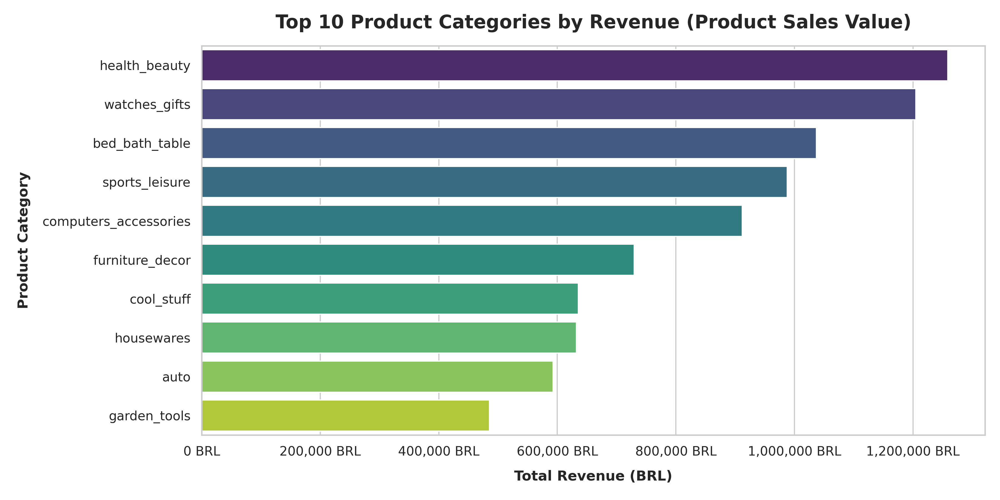
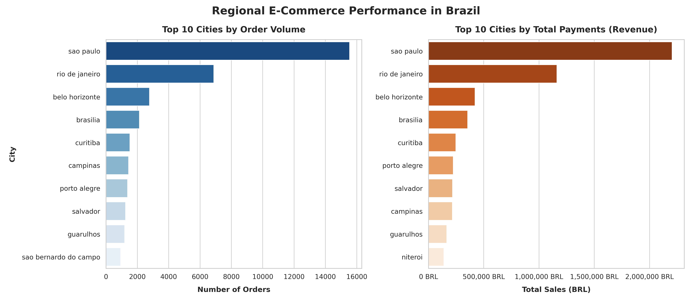
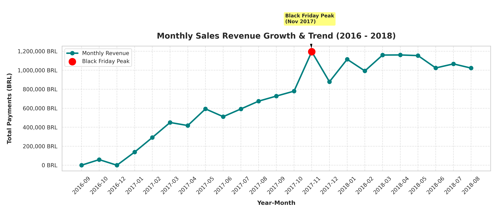
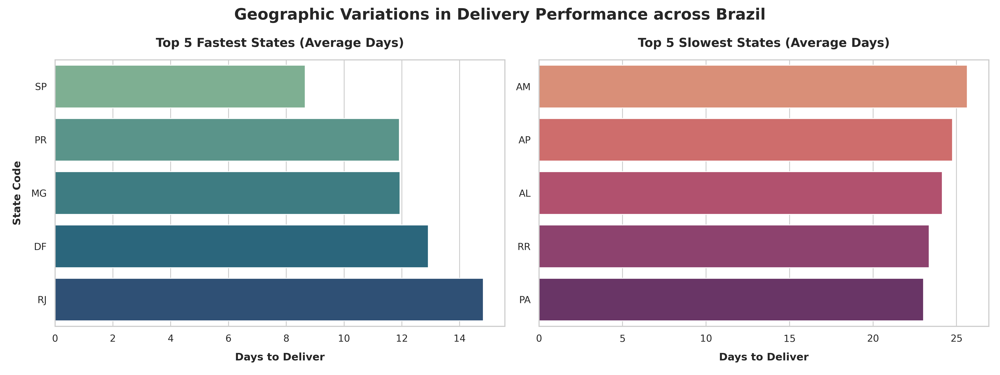
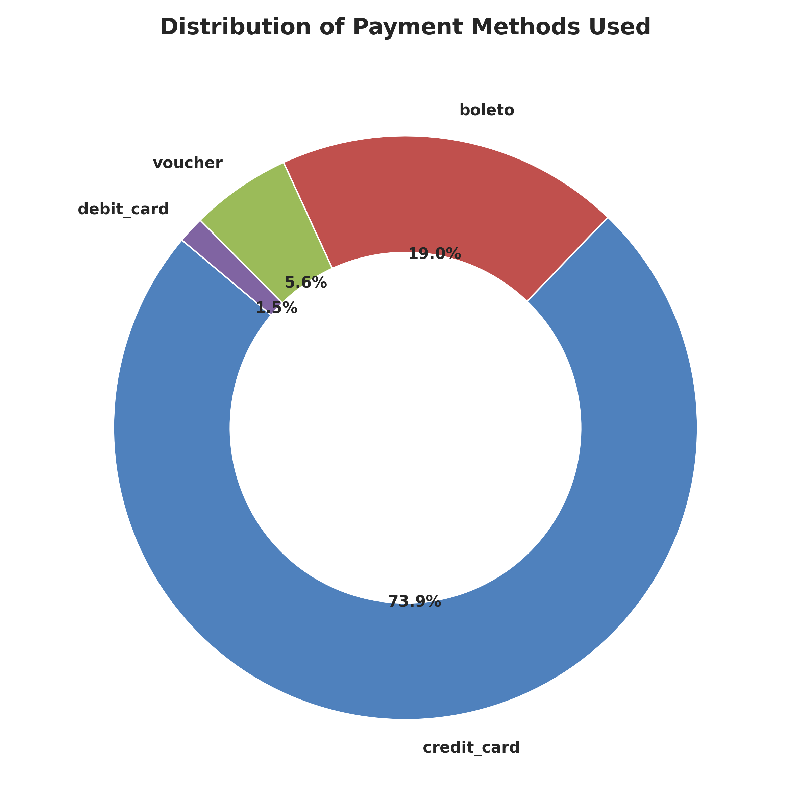
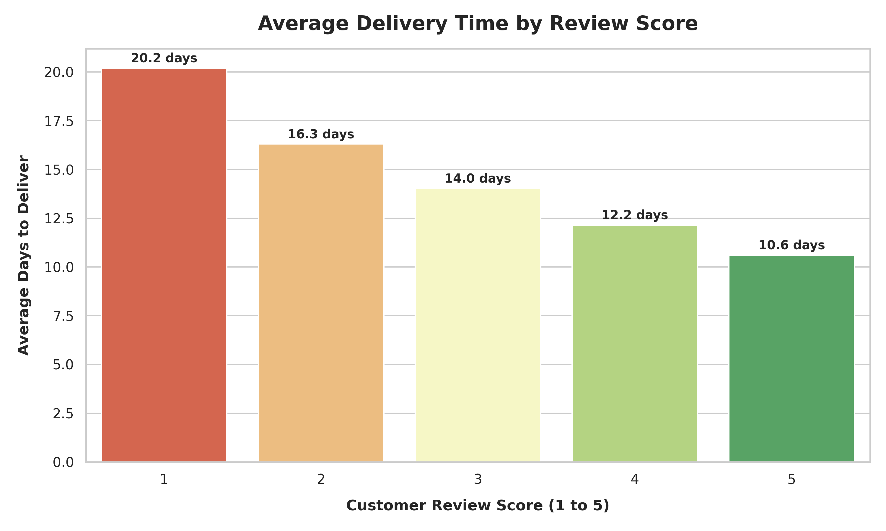
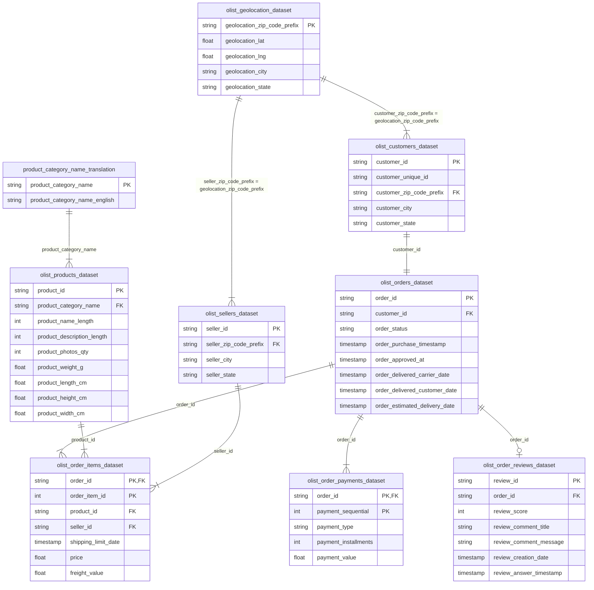

# Olist Brasil E-Commerce Performance & Customer Behavior Analysis

[English](#english) | [Bahasa Indonesia](#bahasa-indonesia)

---

<a name="english"></a>
## 🇬🇧 English Version

### 📌 Executive Summary (30-Second Read)
* **Objective**: Analyzed **100,000+ transaction records** (late 2016 to mid 2018) from **Olist**, Brazil's leading e-commerce platform, to identify revenue drivers, optimize logistics, and improve customer satisfaction.
* **Key Findings**:
  - **Revenue Drivers**: High-performance categories dominate sales, with *Health & Beauty* (high volume) and *Watches & Gifts* (high AOV) generating over **1.2M BRL** each.
  - **Regional Concentration**: São Paulo is the commercial hub, accounting for **15,540 orders** and over **2.2M BRL** in revenue.
  - **Logistics Bottleneck**: Average national shipping time is **12.3 days**, but remote states like Amazonas (AM) average **25.6 days**.
  - **Satisfaction & Speed**: Delivery delay is the primary driver of low review scores. 5-star orders arrive in **10.6 days** on average, whereas 1-star orders take **20.2 days** (negative correlation of **-0.31**).
  - **Retention Gap**: Repeat purchase rate is extremely low at **3.12%** (over 96.8% are one-time buyers).
* **Actionable Recommendations**:
  - **Logistics SLA Optimization**: Establish regional fulfillment hubs or local carrier partnerships in Northern states (AM, AP) to reduce delivery times from 25+ days to under 15 days.
  - **Targeted Inventory & Ads**: Allocate more marketing budget (ROAS-driven) and stock to high-margin/high-AOV categories (e.g., Watches & Gifts).
  - **Customer Retention Program**: Implement automated email campaigns, personalized coupons for the second purchase, and a loyalty program to boost the repeat rate from 3.12% to a target of 8%.

---

### 📊 Key Insights & Visualizations

#### 1. Revenue Drivers by Product Category
A small group of product categories drives the majority of Olist's revenue. **Health & Beauty** and **Watches & Gifts** lead the platform, each contributing over **1.2M BRL**. While Health & Beauty is volume-driven, Watches & Gifts succeeds due to a higher Average Order Value (AOV).


#### 2. Regional Demand Hotspots
Demand is heavily concentrated in Brazil's Southeast region. **São Paulo** represents the largest market, contributing **15,540 orders** and generating **2.2M BRL** in revenue. Rio de Janeiro follows as the second-largest market.


#### 3. Seasonality & Black Friday Spike
Sales grew steadily from 2017 to 2018. A massive surge occurred in **November 2017**, reaching **1.19M BRL**—a **53% month-over-month increase** driven by **Black Friday** promotions.


#### 4. Shipping SLA & Delivery Times
While the national median delivery time is **10.2 days** (average **12.3 days**), regional disparities are severe:
* **Southeast (Fastest)**: São Paulo averages **8.7 days**.
* **North (Slowest)**: Amazonas (AM) averages **25.6 days** and Amapá (AP) averages **24.8 days**.


#### 5. Payment Methods
**Credit Cards** are the dominant payment method, accounting for **73.9%** of transactions, followed by **Boleto** at **19.0%**.


#### 6. Satisfaction vs. Delivery Time
There is a clear negative correlation (**-0.31**) between delivery times and customer review scores. Delayed deliveries are the main cause of 1-star ratings:
* **5-Star Reviews**: Average delivery time of **10.6 days**.
* **1-Star Reviews**: Average delivery time of **20.2 days**.


---

<a name="bahasa-indonesia"></a>
## 🇮🇩 Versi Bahasa Indonesia

### 📌 Ringkasan Eksekutif (30 Detik Baca)
* **Tujuan**: Menganalisis **lebih dari 100.000 catatan transaksi** (akhir 2016 hingga pertengahan 2018) dari **Olist**, platform integrasi e-commerce terbesar di Brasil, untuk menemukan pendorong pendapatan, mengoptimalkan logistik, dan meningkatkan kepuasan pelanggan.
* **Temuan Utama**:
  - **Pendorong Pendapatan**: Penjualan didominasi oleh kategori berkinerja tinggi, yaitu *Health & Beauty* (volume tinggi) dan *Watches & Gifts* (AOV tinggi) dengan kontribusi masing-masing di atas **1,2 juta BRL**.
  - **Konsentrasi Regional**: Wilayah São Paulo merupakan pusat pasar terbesar dengan kontribusi **15.540 pesanan** dan total pendapatan lebih dari **2,2 juta BRL**.
  - **Masalah Logistik**: Rata-rata pengiriman nasional adalah **12,3 hari**, namun negara bagian terpencil di Utara seperti Amazonas (AM) memakan waktu rata-rata **25,6 hari**.
  - **Kepuasan & Kecepatan**: Keterlambatan pengiriman adalah faktor utama ulasan buruk. Pesanan dengan rating bintang 5 rata-rata sampai dalam **10,6 hari**, sedangkan rating bintang 1 memakan waktu **20,2 hari** (korelasi negatif **-0,31**).
  - **Rendahnya Retensi**: Tingkat pembelian berulang (*repeat purchase rate*) sangat rendah, hanya sebesar **3,12%** (lebih dari 96,8% pelanggan adalah pembeli satu kali).
* **Rekomendasi Bisnis**:
  - **Optimasi SLA Logistik**: Bangun kemitraan dengan kurir lokal atau posisikan gudang regional di wilayah Utara (AM, AP) untuk memangkas waktu kirim dari 25+ hari menjadi di bawah 15 hari.
  - **Prioritas Iklan & Stok**: Alokasikan budget iklan (berbasis ROAS) dan inventaris produk pada kategori bernilai tinggi (*Watches & Gifts* dan *Health & Beauty*).
  - **Program Retensi Pelanggan**: Terapkan kampanye email otomatis, kupon belanja kedua, dan program loyalitas untuk menaikkan tingkat pembelian berulang dari 3,12% menjadi target 8%.

---

### 📊 Wawasan Utama & Visualisasi

#### 1. Kategori Produk Pendorong Pendapatan
Sebagian besar nilai penjualan dihasilkan oleh sekelompok kecil kategori produk. **Health & Beauty** dan **Watches & Gifts** adalah kategori utama, masing-masing menghasilkan lebih dari **1,2 juta BRL**.


#### 2. Titik Panas Kinerja Regional
Permintaan sangat terkonsentrasi di wilayah Tenggara Brasil. **São Paulo** menyumbang **15.540 pesanan** dan menghasilkan lebih dari **2,2 juta BRL**.


#### 3. Musiman & Pertumbuhan Penjualan
Penjualan tumbuh secara konsisten dari awal tahun 2017 hingga pertengahan 2018. Lonjakan signifikan terjadi pada **November 2017**, mencapai **1,19 juta BRL** (naik **53%** bulanan) karena promosi **Black Friday**.


#### 4. Waktu Pengiriman Regional
Rata-rata waktu pengiriman di seluruh Brasil adalah **12,3 hari** (median: 10,2 hari):
* **Tercepat**: São Paulo rata-rata **8,7 hari**.
* **Terlambat**: Amazonas (AM) rata-rata **25,6 hari** dan Amapá (AP) rata-rata **24,8 hari**.


#### 5. Metode Pembayaran
**Kartu Kredit** mendominasi pembayaran sebesar **73,9%**, diikuti oleh **Boleto** sebesar **19,0%**.


#### 6. Dampak Kecepatan Pengiriman pada Ulasan Pelanggan
Analisis menunjukkan korelasi negatif yang jelas (**-0,31**) antara waktu pengiriman dan skor ulasan pelanggan:
* **Ulasan Bintang 5**: Dikirim dalam rata-rata **10,6 hari**.
* **Ulasan Bintang 1**: Dikirim dalam rata-rata **20,2 hari**.


---

## 🗄️ Skema Dataset (ERD)
Dataset ini terdiri dari 9 tabel yang saling terhubung, di-host di Kaggle:



---

## ⚙️ Technologies Used
* **Python 3.11**
* **Pandas & NumPy** (Data wrangling, merging, aggregation)
* **Matplotlib & Seaborn** (Data visualization)
* **Jupyter Notebook** (Interactive analysis)

---

## 🚀 How to Run the Project

1. **Clone & Set Up Directory**:
   Ensure your structure looks like this:
   ```text
   olist-brazilian-ecommerce-analytics/
   ├── data/
   │   ├── olist_customers_dataset.csv
   │   ├── olist_orders_dataset.csv
   │   ├── olist_order_items_dataset.csv
   │   ├── olist_order_payments_dataset.csv
   │   ├── olist_order_reviews_dataset.csv
   │   ├── olist_products_dataset.csv
   │   ├── olist_sellers_dataset.csv
   │   ├── olist_geolocation_dataset.csv
   │   └── product_category_name_translation.csv
   ├── images/
   ├── notebook.ipynb
   └── requirements.txt
   ```

2. **Install Dependencies**:
   ```bash
   pip install -r requirements.txt
   ```

3. **Run the Notebook**:
   ```bash
   jupyter notebook notebook.ipynb
   ```
